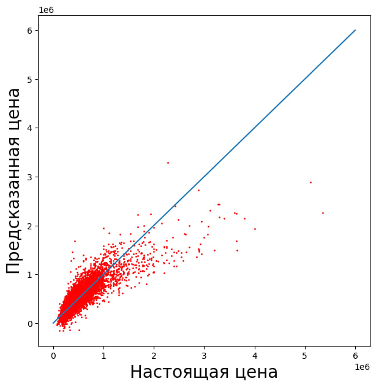
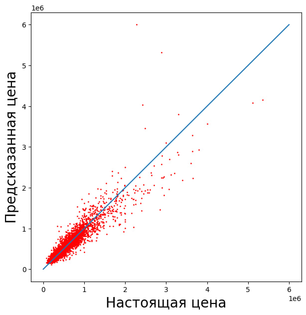

# 🏡 Прогнозирование стоимости недвижимости (House Price Prediction)

## 📌 Описание проекта

В рамках проекта была решена задача регрессии — предсказание стоимости недвижимости на основе характеристик объектов (площадь, количество комнат, геолокация и др.).

Целью работы было:

* обучить модели машинного обучения для предсказания цены
* сравнить качество различных алгоритмов
* исследовать влияние признаков
* подобрать гиперпараметры
* определить наиболее точную модель

---

## 📊 Данные

Использовался датасет с характеристиками объектов недвижимости.

**Размер данных:**

* 15 129 объектов
* 16 признаков (включая целевую переменную)

**Целевая переменная:**

* `Целевая.Цена`

**Примеры признаков:**

* Жилая площадь
* Общая площадь
* Количество спален
* Количество ванных
* Год постройки
* Географические координаты (широта, долгота)
* Оценка риелтора

---

## ⚙️ Предобработка данных

На этапе анализа данных было установлено:

* пропущенные значения отсутствуют
* данные представлены числовыми признаками (int64, float64)

Целевая переменная была отделена от входных признаков:

* `training_values` — цена
* `training_points` — признаки

---

## 🤖 Использованные модели

В проекте были исследованы следующие модели:

### 1. Линейная регрессия

Базовая модель (baseline), позволяющая оценить линейную зависимость между признаками и целевой переменной.

### 2. Random Forest

Ансамблевый метод, основанный на решающих деревьях.

Проводились эксперименты:

* с полным набором признаков
* с удалением наименее значимых признаков
* с подбором гиперпараметров

### 3. Gradient Boosting

Ансамблевая модель, обучающая деревья последовательно с исправлением ошибок предыдущих моделей.

---

## 🔍 Анализ важности признаков

Была рассчитана важность признаков (feature importance).

Наименее значимыми оказались:

* Год реновации
* Количество этажей
* Спальни
* Состояние
* Площадь подвала

Проведены эксперименты:

* удаление 3 наименее значимых признаков
* удаление 5 наименее значимых признаков

---

## 📈 Метрики качества

Для оценки моделей использовались:

* **MAE (Mean Absolute Error)**
* **MSE (Mean Squared Error)**
* **RMSE (Root Mean Squared Error)**

Основной метрикой сравнения выбран **RMSE**, так как:

* измеряется в тех же единицах, что и цена
* сильнее штрафует большие ошибки

---

## 📊 Результаты

| Модель                 | MAE        | RMSE        |
| ---------------------- | ---------- | ----------- |
| Gradient Boosting      | 75 871     | **133 304** |
| Random Forest (drop 3) | **70 408** | 135 120     |
| Random Forest (buffed) | 70 441     | 135 909     |
| Random Forest (all)    | 70 838     | 136 960     |
| Linear Regression      | 126 852    | 201 883     |

---

## 🧠 Выводы

* Линейная регрессия показала наихудшее качество из-за неспособности моделировать нелинейные зависимости
* Random Forest значительно улучшил качество предсказания
* Удаление части слабых признаков позволило улучшить модель
* Слишком агрессивное удаление признаков ухудшает результат
* Подбор гиперпараметров Random Forest не всегда приводит к улучшению

### 🏆 Лучшая модель

**Gradient Boosting** показала наилучший результат:

* RMSE ≈ **133 304**

Это объясняется тем, что модель:

* обучается последовательно
* исправляет ошибки предыдущих моделей
* лучше захватывает сложные зависимости

---

## 🚀 Интеграция модели в веб-сервис

Обученную модель можно интегрировать в веб-приложение (Flask / FastAPI / Django).

### Основные шаги:

1. Обучить модель в ноутбуке
2. Сохранить модель (pickle / joblib)
3. Создать API (например, FastAPI)
4. Загрузить модель при запуске сервера
5. Создать endpoint `/predict`
6. Принимать входные данные пользователя
7. Преобразовывать данные в нужный формат
8. Вызывать `model.predict()`
9. Возвращать результат

---

## 🛠️ Используемые технологии

* Python
* Pandas
* NumPy
* Scikit-learn
* Matplotlib

---

## 📎 Ссылки

* 📓 Ноутбук с решением: https://colab.research.google.com/drive/1saHDYmdRMorJKzAxilSathy6tC8B2IgB?usp=sharing
* 🌐 Описание: https://yannisbtw.github.io/labs/semester_2/Python/README5/ или https://shadowkreys.sourcecraft.site/shadowkreys-sourcecraft-site/labs/semester_2/Python/README5/

---

## 📌 Итог

В ходе проекта было показано, что выбор модели играет ключевую роль в задачах машинного обучения: разница между лучшей и худшей моделью составила более **68 000 по RMSE**.

---
